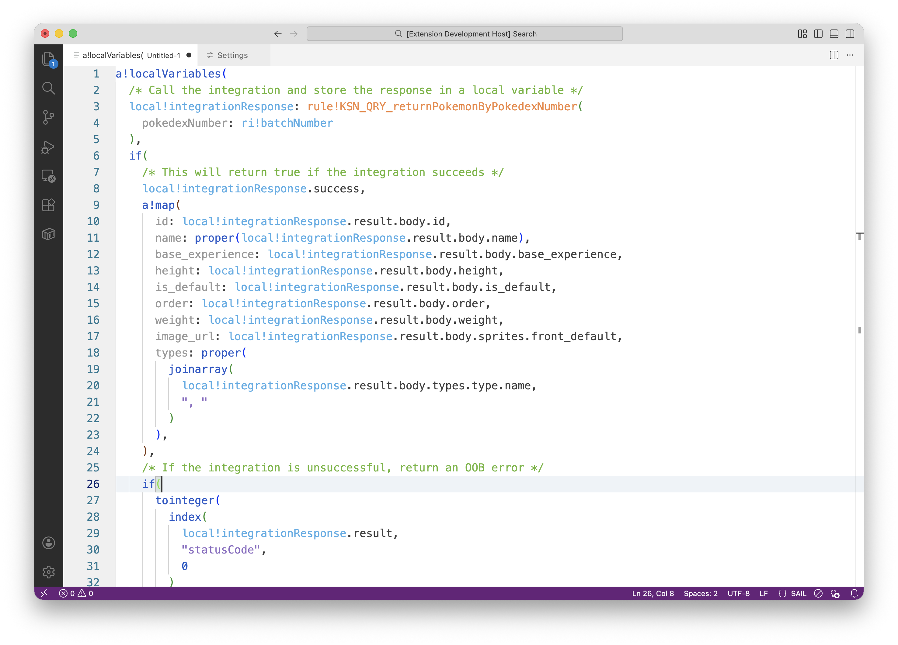
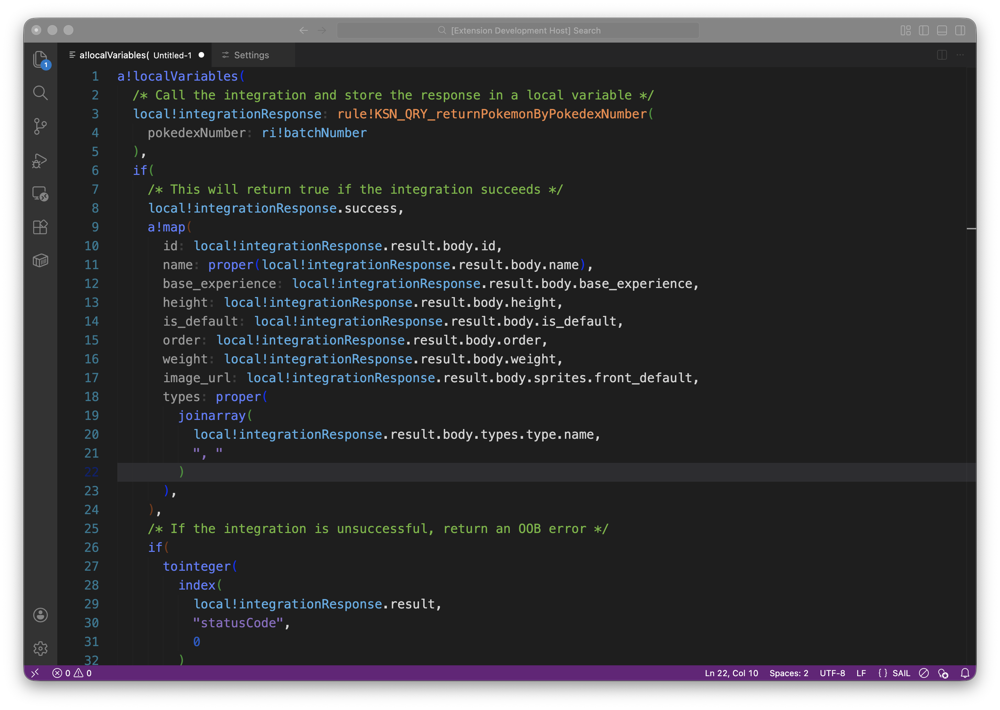
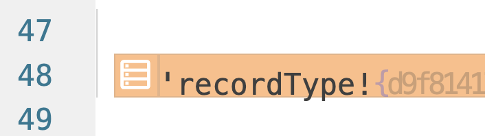

# Visual Studio Code Language Support for Appian Expressions
An extension for Visual Studio Code that provides formatting and syntax highlighting for code constructed inside an Appian Expression Editor.

The typical Appian Developer has 50 browser tabs and 5 browser windows open. Sometimes you just want to paste mock data or debug data inside of a scratchpad. This extension handles formatting that data as well as syntax highlighting for easy readability.

| Light Mode | Dark Mode |
| :---: | :---: |
|  |  |

## Features
- Formats arrays, functions, etc.
- Dark Mode and Light Mode
- Syntax Highlighting for functions, expression rules, local variables, and more
- Pillbox highlights around literal Appian Object references like Record Types (record types for now, more planned for future)

## Known Issues
- Syntax highlighting for variables indexed through dot notation don't carry over. 
- Semantic Highlighting sometimes fails in dark mode, or doesn't play nicely with whatever theme currently set in VS Code. This is because token highlighting is done with TextMate, and either the theme is overriding token colors, or semantic highlighting is overriding token colors. To fix, either set your theme to the provided "Sail Expression Editor-Light" theme or the "Sail Expression Editor- Dark" themes. You can also try to insert the provided tokenColors map into own settings.json. 

## To Do
- Add formatting logic to pillbox other literal object references like Sites, Portals, Translation Strings, etc.
- Make the pillbox prettier, margins are kinda ugly right now
- Refactor extension.js code, consider removing hardcoded regex group extraction (to accomodate all you crazy devs that go 4 record relationships deep)