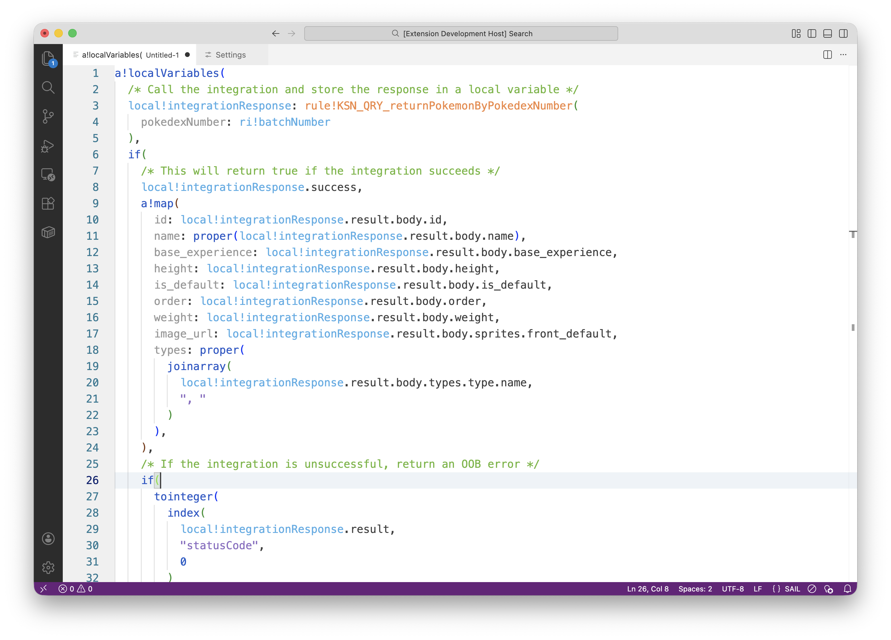
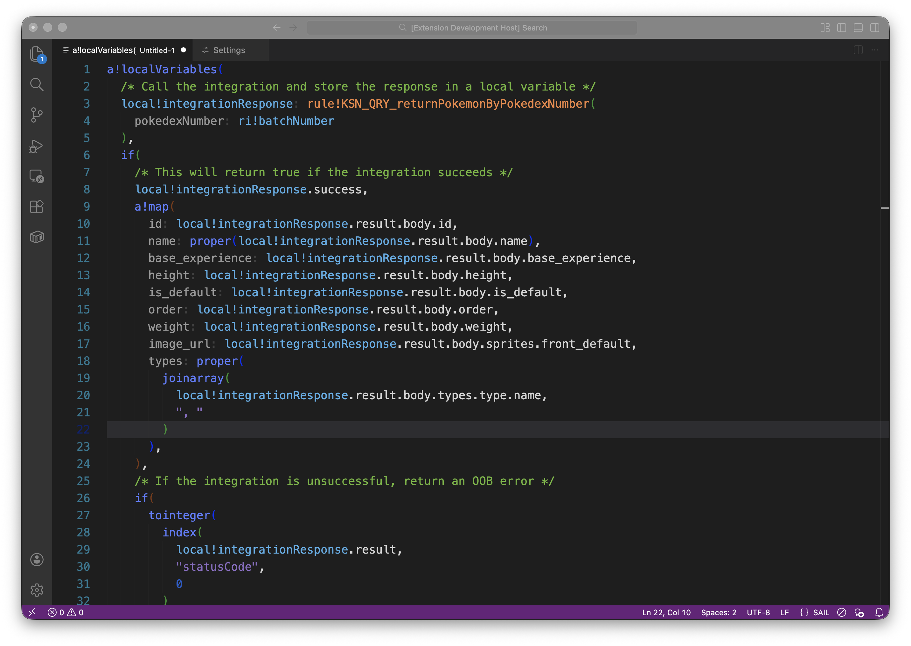
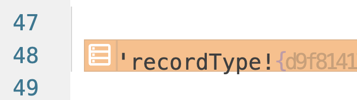

# Visual Studio Code Language Support for Appian Expressions
An extension for Visual Studio Code that provides formatting and syntax highlighting for code constructed inside an Appian Expression Editor.

| Light Mode | Dark Mode |
| :---: | :---: |
|  |  |

## Features
- Formats arrays, functions, etc.
- Dark Mode and Light Mode
- Syntax Highlighting for functions, expression rules, local variables, and more
- Automatic language detection: paste SAIL into a new VS Code window and the language is switched to SAIL for you (only triggers on plaintext documents, never overrides an explicit language choice). Can be disabled via the `sail.autoDetect` setting.
- Pillbox highlights around literal Appian Object references like Record Types (record types and site objects for now, more planned for future). UUIDs are still available but de-emphasized, and indexed fields/relationships/site pages/etc. are bolded for easy dev reference. 

## Installing
Install this from the VSIX file provided from the releases page until this is uploaded to the extensions marketplace.
1. Download the extension from the Releases page. 
2. Open Visual Studio Code's Sidebar > Extensions > Three Dots on the Top Right
3. Select "Install from VSIX" file and select the file

## Known Issues
- Auto-detection runs only on plaintext documents, so files VS Code has already classified as another language (e.g. JavaScript) won't be switched automatically — use "Change Language Mode" to set SAIL manually in those cases.
- Sometimes, the pillbox is out of bounds from the text. This is usually due to DPI settings or zoom settings on your computer. 
- Semantic Highlighting sometimes fails in dark mode, or doesn't play nicely with whatever theme currently set in VS Code. This is because token highlighting is done with TextMate, and either the theme is overriding token colors, or semantic highlighting is overriding token colors. To fix, either set your theme to the provided "Sail Expression Editor-Light" theme or the "Sail Expression Editor- Dark" themes. You can also try to insert the provided tokenColors map into own settings.json. 
- The formatter assumes that your code is valid. If you have a missing comma, the formatter will fail to carriage return your code. This plugin will not validate your code for you. 

## To Do
- Add formatting logic to pillbox other literal object references like Portals, Translation Strings, etc.
